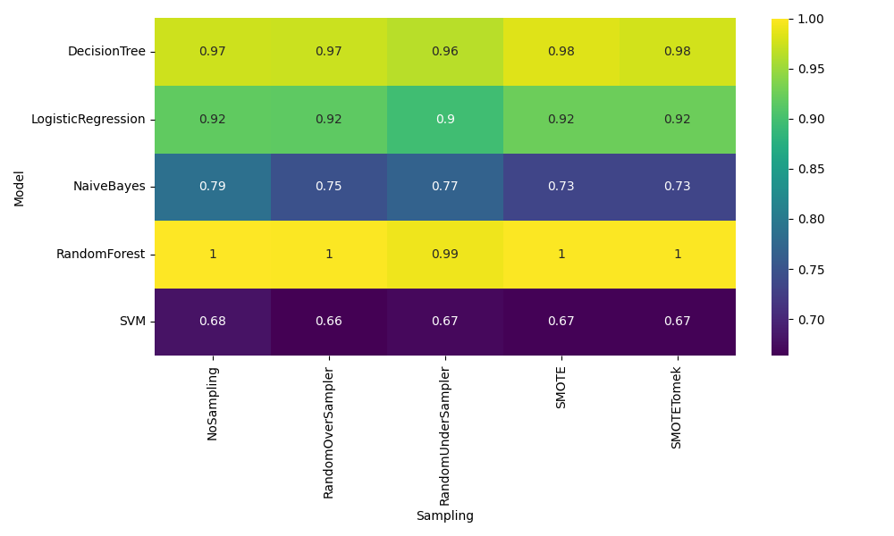

  

# Credit Card Fraud Sampling & Machine Learning Analysis

This repository presents a complete machine learning workflow to analyze how different **sampling techniques influence model performance** on a highly imbalanced credit card fraud dataset.

The project balances the dataset using **SMOTE**, applies **five sampling techniques**, trains **five different machine learning models**, and evaluates all model–sampling combinations using **stratified cross-validation and accuracy metrics**.

---

## Table of Contents

1. [Project Overview](#project-overview)  
2. [Input and Output](#input-and-output)  
3. [Methodology](#methodology)   
4. [Results](#results)  
5. [Visualizations](#visualizations)  

---

## Project Overview

In real-world applications such as credit card fraud detection, datasets are often **highly imbalanced**, with fraudulent transactions representing only a very small fraction of the total data.

This imbalance causes most machine learning models to become biased toward the majority class, leading to poor detection of fraudulent cases.

This project addresses the problem by:

- Balancing the dataset using **SMOTE**  
- Applying multiple sampling strategies  
- Training multiple machine learning models  
- Comparing performance across all model–sampling combinations  
- Visualizing and analyzing the results  

---

## Input and Output

### Input

- **Dataset:** `Creditcard_data.csv`  
- **Source:** GitHub repository provided in the assignment  
- **Target Column:** `Class`  
  - `0` → Legitimate transaction  
  - `1` → Fraudulent transaction  

---

### Output

The following output files are generated and stored in the project directory:

| File Name | Description |
|-----------|-------------|
| [`accuracy_matrix.csv`](./accuracy_matrix.csv) | Accuracy values for all model × sampling combinations |
| [`best_sampling_per_model.csv`](./best_sampling_per_model.csv) | Best sampling technique for each model |
| [`accuracy_heatmap.png`](./accuracy_heatmap.png) | Heatmap of accuracy values |
| [`best_accuracy_per_model.png`](./best_accuracy_per_model.png) | Best accuracy per model |
| [`avg_accuracy_per_sampling.png`](./avg_accuracy_per_sampling.png) | Average accuracy per sampling technique |
| [`accuracy_lineplot_all_combinations.png`](./accuracy_lineplot_all_combinations.png) | Accuracy trend line plot |

---

## Methodology

The complete workflow follows the steps below.

---

### 1. Data Loading and Initial Analysis

The dataset is loaded using the **pandas** library.  
The dataset shape and class distribution are printed to verify the imbalance.

A bar plot is generated to visualize the class distribution **before balancing**.  
This confirms the severe imbalance between legitimate and fraudulent transactions.

---

### 2. Dataset Balancing using SMOTE

The original dataset is highly imbalanced.  
To convert it into a balanced dataset, **SMOTE (Synthetic Minority Over-sampling Technique)** is applied.

SMOTE works by:

- Generating synthetic samples for the minority class  
- Creating new data points in feature space based on nearest neighbors  
- Avoiding direct duplication of minority samples  

After applying SMOTE:

- Both classes have equal representation  
- The dataset becomes suitable for fair model training  

A bar plot is generated to visualize the class distribution **after balancing**.

---

### 3. Sampling Techniques Applied

After balancing, five different sampling techniques are applied to the balanced dataset.

| Sampling ID | Technique | Description |
|-------------|-----------|-------------|
| Sampling1 | Simple Random Sampling | Randomly selects a subset of records |
| Sampling2 | Systematic Sampling | Selects records at fixed intervals |
| Sampling3 | Stratified Sampling | Preserves class proportions |
| Sampling4 | Cluster Sampling | Uses KMeans clusters for selection |
| Sampling5 | Bootstrap Sampling | Samples records with replacement |

Each sampling technique generates a new dataset that is used for training and evaluation.

---

### 4. Machine Learning Models Used

Five different machine learning models are trained on each sampled dataset.

| Model ID | Model Name |
|---------|------------|
| M1 | Naive Bayes |
| M2 | Gradient Boosting Classifier |
| M3 | Extra Trees Classifier |
| M4 | Multi-Layer Perceptron (Neural Network) |
| M5 | SGD Classifier |

---

### 5. Model Training and Evaluation

For each combination of:

- Sampling Technique  
- Machine Learning Model  

The following steps are performed:

1. Feature scaling using **StandardScaler**  
2. Stratified 5-fold cross-validation  
3. Accuracy computation for each fold  
4. Mean accuracy recorded for the combination  

This ensures stable and fair evaluation across all combinations.

---

## Results

### Final Accuracy Table

A final accuracy matrix is generated showing:

- Rows → Machine Learning Models (M1–M5)  
- Columns → Sampling Techniques (Sampling1–Sampling5)  
- Values → Mean accuracy (%)  

The table is printed in the notebook and saved as:

- [`accuracy_matrix.csv`](./accuracy_matrix.csv)

This table allows direct comparison of how each sampling technique affects each machine learning model.

---

### Best Sampling Technique per Model

For each model, the sampling technique that yields the highest accuracy is identified.

This summary is stored in:

- [`best_sampling_per_model.csv`](./best_sampling_per_model.csv)

This table contains:

- The best sampling method for each model  
- The corresponding best accuracy value  

---

### Overall Best Combination

The best overall model–sampling combination is determined by selecting the highest accuracy value from the entire accuracy matrix.

This identifies:

- The most effective sampling technique  
- The most accurate machine learning model  

---

## Visualizations

Several meaningful visualizations are generated to support the analysis.

---

### Class Distribution (Before and After Balancing)

Two bar plots are generated:

- Class distribution before SMOTE  
- Class distribution after SMOTE  

These plots confirm:

- Severe imbalance in the original dataset  
- Perfect class balance after applying SMOTE  

---

### Accuracy Heatmap

A heatmap is generated showing:

- Models on the Y-axis  
- Sampling techniques on the X-axis  
- Accuracy values represented by color intensity  

This provides a quick visual comparison of all model–sampling combinations.

- [`accuracy_heatmap.png`](./accuracy_heatmap.png)

---

### Best Accuracy per Model

A bar chart shows:

- The best accuracy achieved by each model  

This highlights which models perform best overall.

- [`best_accuracy_per_model.png`](./best_accuracy_per_model.png)

---

### Average Accuracy per Sampling Technique

A bar chart shows:

- The average accuracy of each sampling technique across all models  

This visualization answers the question:

> Which sampling technique performs best on average?

- [`avg_accuracy_per_sampling.png`](./avg_accuracy_per_sampling.png)

---

### Accuracy Trend Line Plot

A line plot shows:

- Sampling techniques on the X-axis  
- Accuracy values on the Y-axis  
- One line per model  

This visualization illustrates how sensitive each model is to different sampling strategies.

- [`accuracy_lineplot_all_combinations.png`](./accuracy_lineplot_all_combinations.png)

---

